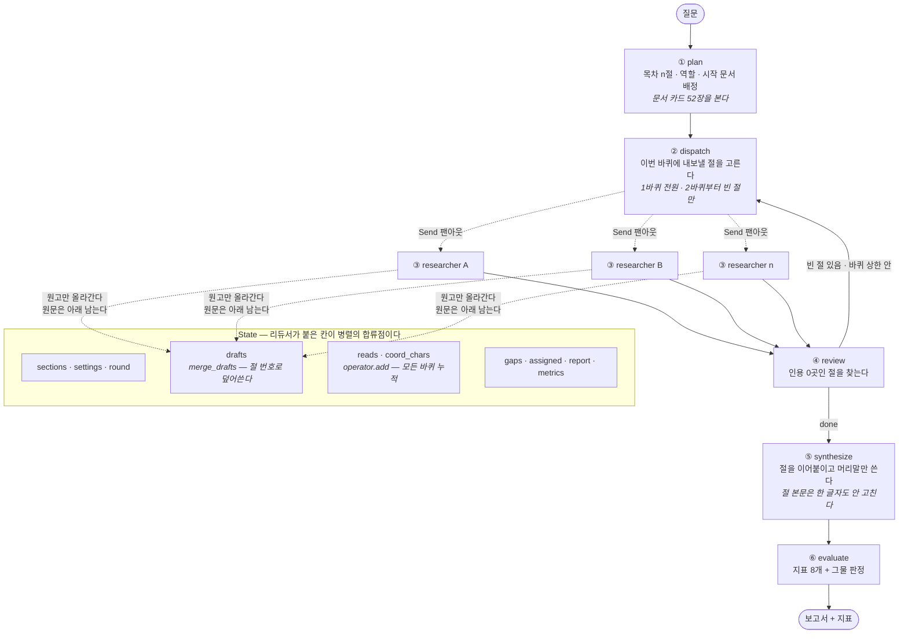

# MBTI 검증 딥리서치 에이전트

**LangGraph 6노드 딥리서처**가 영문 위키백과 52건을 읽고 한국어 보고서를 쓴다.
그 과정을 **아이소메트릭 연구소**로 재생한다 — 조사관이 서고를 오가고, 책상에서 글을 쓰고, 코디네이터가 빈 칸을 지적하는 장면까지.

> 🔗 **https://deep-research-agent-chungwonjoung-8174s-projects.vercel.app**
> 키 없이 녹화 12편을 재생한다. 본인 OpenAI 키를 넣으면 자기 질문으로 라이브 실행도 된다.

모두의연구소 8강 「딥리서치 에이전트 만들기 — 오케스트레이션」 과제.

---

## 리뷰어를 위한 길 안내

> **제출 보고서는 [`REPORT.md`](REPORT.md) 다.** 주제·코퍼스 · 분업 설계 · 지표 ·
> 구조도 · 데모 설계(캡처) · 회고가 그 문서에 있다. 아래는 코드를 볼 때의 길 안내다.

피어리뷰 템플릿(PRT) 다섯 항목이 어디에 있는지 먼저 적는다.

| PRT 항목 | 어디를 보면 되는가 |
|---|---|
| **1. 실행 가능성** | [3분 안에 확인하기](#3분-안에-확인하기) — 키 없이 배포본, 또는 clone 후 한 바퀴 |
| **2. 아키텍처 가독성** | [아키텍처](#아키텍처) — 6노드 그림 · 노드별 하는 일 · **왜 이 패턴인가** |
| **3. 측정 가능성** | [무엇을 어떻게 쟀는가](#무엇을-어떻게-쟀는가) — 지표 정의 · 합격 기준 · **개선 전 → 후** |
| **4. 견고성** | [실패하는 길](#실패하는-길) — 폭주 방지 · 예외 처리 · 이상한 입력에 대한 반응 |
| **5. 작업 추적성** | [무엇을 고쳤는가](#무엇을-고쳤는가) — 커밋 · 실측 기록 17장 · 프롬프트 위치 |

리뷰어가 던질 ❓ 질문에 답할 재료는 [기획과 시행착오](#기획과-시행착오)에 모아 뒀다.

---

## 다루는 질문

> **"MBTI 궁합론은 어떤 근거로 제시되며, 심리학계는 이를 어떻게 평가하는가?"**

이 파이프라인의 핵심 장치는 **문장마다 «문서명» 근거를 붙이는 것**이다.
근거가 빈약한 채로 널리 믿기는 주제를 고르면 그 장치의 의미가 증폭된다.
코퍼스는 영문, 보고서는 한국어 — 원문 언어 ≠ 산출물 언어도 이 구조가 감당한다.

---

## 3분 안에 확인하기

### ① 아무것도 설치하지 않고 (키 불필요)

**https://deep-research-agent-chungwonjoung-8174s-projects.vercel.app**

「재생」 탭에서 녹화 12편 중 하나를 고르고 ▶ 재생. 12~28초짜리 장면이 돌아간다.
왼쪽에 그때 실제로 나온 지표가, 「보고서」 버튼에 그때 쓴 한국어 보고서가 있다.
**이 12편은 실제로 AI를 돌려 녹화한 것이다** — 숫자도 보고서도 그때 나온 값이다.

### ② 직접 돌려 보기 (₩40 · 40초)

**OpenAI API 키가 필요하고, 본인 키로 청구된다** (한 바퀴 약 ₩40). 키는 OpenAI 계정의
[API keys](https://platform.openai.com/api-keys) 에서 발급한다. 키 없이 보려면 위 ①로 충분하다.

**1) 받아서 환경 만들기**

```bash
git clone https://github.com/GojoSuperman/Deep-research-agent.git
cd Deep-research-agent
uv venv --python 3.12 .venv          # 시스템 기본 3.14는 라이브러리 호환 문제가 있다
uv pip install -r requirements.txt
```

`uv` 가 없으면 표준 도구로도 된다 (Python 3.12 기준).

```bash
python3.12 -m venv .venv && .venv/bin/pip install -r requirements.txt
```

**2) 키 넣기** — `.env.local`(권한 600 · git 제외)에 저장된다. 저장소에는 올라가지 않는다.

```bash
.venv/bin/python -m pipeline.setkey              # 물어보면 키를 붙여 넣는다
```

터미널이 대화형 입력을 못 받는 환경이면(에이전트·CI·`!` 프리픽스 실행 등) 이렇게 넣는다.

```bash
.venv/bin/python -m pipeline.setkey --from-file /경로/key.txt --wipe   # 읽고 그 파일을 지운다
.venv/bin/python -m pipeline.setkey --from-clipboard                    # 윈도우 클립보드에서
```

**키가 실제로 먹는지 먼저 확인한다** — 아주 짧은 호출 한 번이라 값이 거의 들지 않는다.

```bash
.venv/bin/python -m pipeline.setkey --check
```
```
  파일   …/.env.local 있음
  키     sk-…xxxx (164자)
  모델   gpt-4o-mini
  결과   ✅ 먹는다 · 응답 'ping' · 토큰 14
```

`❌` 가 나오면 이유를 그대로 보여 준다 — `401` 이면 키가 거부된 것, `429` 면 잔액·한도,
`403` 이면 그 키로 이 모델을 못 쓰는 것이다.

**3) 한 바퀴 돌리기**

```bash
.venv/bin/python -m pipeline.run
```

이벤트가 한 줄씩 찍히고 마지막에 보고서와 지표가 나온다. 이런 모양이다.

```
{"type":"run.start","question":"MBTI 궁합론은 …","설정":{"절수":4,"절예산":3,…}}
{"type":"plan.done","목차":[{"절":"MBTI 궁합론의 근거","서고":"유형론"}, …]}
{"type":"dispatch","바퀴":1,"인원":4,…}
{"type":"researcher.read","조사관":"r1","문서":"Myers–Briggs Type Indicator",…}
…
근거율 0.93 · 인용0곳절 0 · 허위인용 0 · 그물 통과 · 2,611자 · ₩41 · 38초
```

실행 옵션:

| 옵션 | 뜻 |
|---|---|
| `-q "질문"` | 질문 바꾸기 |
| `--sections N` / `--budget N` | 절 수(=조사관 수) / 절당 읽을 문서 수 (기본 4절 × 3건) |
| `--no-assign` `--no-zone` `--no-role` `--no-redelegate` | 절제 실험 스위치 |
| `--save runs/이름.json` | 이벤트 스트림 저장 (재생용) |
| `--quiet` | 이벤트를 찍지 않는다 |

### ③ 웹앱을 로컬에서 보기

```bash
.venv/bin/python tools/dev_server.py 8734   # → http://127.0.0.1:8734
```

캐시를 끄는 개발 서버다. 보통 `http.server` 로 띄우면 브라우저가 옛 모듈을 쥐고 있어 수정이 안 보인다.
**`/api/live` 도 이 서버가 받는다** (Vercel과 같은 핸들러). 개발 중에는 화면의 키 칸을 비워 둬도
`.env.local` 키로 돈다 — 이 관대함은 `dev_server.py` 에만 있다.

---

## 아키텍처

### 6노드

```
질문 ─▶ ① 기획 ─▶ ② 배치 ─┬▶ ③ 조사관 A ─┐
       목차·역할·배정   Send  ├▶ ③ 조사관 B ─┤
                       팬아웃 ├▶ ③ 조사관 C ─┼▶ ④ 점검 ─done─▶ ⑤ 종합 ─▶ ⑥ 평가 ─▶ 보고서+지표
                             └▶ ③ 조사관 D ─┘   빈 칸 찾기        절 이어붙이기
                                    ▲                 │
                                    └────── more ─────┘   (최대 2바퀴)
```

| 노드 | 하는 일 | 코드 |
|---|---|---|
| ① `plan` | 질문을 4절 목차로 쪼개고, 절마다 **역할**과 **시작 문서**를 정한다 | `pipeline/nodes.py` |
| ② `dispatch` | 이번 바퀴에 누구를 내보낼지 고른다. 1바퀴는 전원, 2바퀴부터는 **빈 절만** | `nodes.py:76` |
| ③ `researcher` | 시작 문서부터 링크를 타고 `budget`건을 읽어 메모를 남기고 원고를 쓴다 | `nodes.py:129` |
| ④ `review` | 근거가 0곳인 절을 찾는다. 있으면 ②로 되돌려 보낸다(재위임) | `nodes.py:237` |
| ⑤ `synthesize` | 절 원고를 이어붙여 보고서 하나로 만든다 | `nodes.py` |
| ⑥ `evaluate` | 지표 8개를 재고 그물 판정을 내린다 | `pipeline/metrics.py` |

조립은 `pipeline/graph.py` 에 다 들어 있다. `add_node` 여섯 줄과 `add_conditional_edges` 두 줄이 전부다.

### 노드와 상태 흐름



> 렌더된 그림: [`docs/그림/구조도.svg`](docs/그림/구조도.svg) · 원본: [`docs/그림/구조도.mmd`](docs/그림/구조도.mmd)

**리듀서가 이 그래프의 핵심이다.** 조사관 n명이 동시에 같은 칸에 쓰므로, `drafts` 는
절 번호로 덮어쓰고(`merge_drafts` — 재위임 바퀴의 새 원고가 이긴다) `reads`·`coord_chars` 는
더해서 쌓는다(`operator.add`). 이 두 규칙이 없으면 마지막에 끝난 조사관이 남의 결과를 지운다.

### 왜 이 패턴인가 — 결정 셋

**1. 왜 팬아웃(Send)인가 — 한 번에 못 넣기 때문이다.**
코퍼스는 1,705,434자 ≈ 852,700 토큰으로, `gpt-4o-mini` 컨텍스트(128,000)의 **6.7배**다.
한 에이전트에 다 넣는 선택지가 애초에 없다. 절마다 조사관을 하나씩 붙여 각자 읽게 하고,
읽은 원문(94,675자)은 메모(631자)로 줄여 상단으로 올린다 — **컨텍스트 격리 0.7%**.

**2. 왜 되돌려 보내는 루프(review → dispatch)인가 — 평균이 구멍을 덮기 때문이다.**
근거율 82%는 멀쩡해 보이지만 한 절이 근거 0일 수 있다. 그래서 점검 노드가 **절 단위**로 빈 칸을 찾고,
빈 절만 골라 다시 내보낸다. 무한 루프를 막으려 `max_rounds=2` 와 `recursion_limit` 을 건다.

**3. 왜 이벤트 스트림을 분리했는가 — 스위치를 넣을 때마다 백엔드를 뜯지 않으려고.**

```
 [이벤트 소스]          [번역/연출]         [월드 상태]        [렌더러]
 무슨 일이 있었나   →   어떻게 보여줄까   →   지금 상태     →   화면
 ──────────────      ─────────────      ──────────      ────────
 재생: runs/*.json    Choreographer      World            Canvas
 라이브: SSE          (프런트)           (조사관/절)       (아이소메트릭)
```

**백엔드는 "조사관이 어느 서고로 걸어가야 하는지" 모른다.** 그 번역은 전적으로 프런트의 몫이다.
덕분에 절제 실험 스위치 4개를 넣을 때 백엔드는 설정 플래그만 더하면 됐다.

### 두 실행 모드

| | 재생 모드 (기본) | 라이브 모드 (옵션) |
|---|---|---|
| 이벤트 소스 | `runs/*.json` 정적 파일 | SSE 스트림 |
| API 키 | 불필요 | **방문자 본인 키** (저장하지 않는다) |
| 백엔드 | 없음 | Python 함수 (`api/live.py`) |
| 대기 | 즉시 | 간단 약 20초 · 정식 약 40초 |

---

## 코퍼스 (실측)

```
52건 · 1,705,434자 · 링크 485개 (문서당 9.3)
추정 852,700 토큰 = gpt-4o-mini 창(128,000)의 6.7배
서고 6분류: 측정 11 · 유형론 11 · 성격심리 11 · 유사사례 7 · 편향 6 · 관계 6
고립 문서 1건: Assortative mating  ← 버그가 아니다. 링크로 못 닿는데 질문엔 꼭 필요한 문서
```

한국어판 위키백과는 16유형이 전부 리다이렉트라 탈락시켰다. 후보 3안을 실제로 수집해 비교한 결과다.

---

## 무엇을 어떻게 쟀는가

### 지표 8개 — 강의 6개 + 둘

| 지표 | 종류 | 어떻게 재는가 | **어느 장치를 보는 신호인가** |
|---|---|---|---|
| 근거율 | 신호 | `«…»` 가 든 문장 수 ÷ 전체 문장 수 | **쓰기 프롬프트의 인용 규칙** |
| 허위 인용 | 경보 | 인용한 문서명이 그 절이 읽은 목록에 있는지 대조 | 쓰기 프롬프트의 **허용 목록** |
| 출처 불일치 | 경보 | 문장의 고유명사를 **원문에서 문자열 검색** | 허위 인용 **교정 규칙** |
| **인용 0곳 절 수** | 경보 | 절마다 인용 개수를 세어 0인 절을 센다 | **재위임** |
| 최다 문서 편중 | 경보(>50%) | 가장 많이 인용된 문서의 인용 점유율 | 읽기 **예산 규모** |
| 중복률 | 신호 | 두 절 이상이 읽은 문서 수 ÷ 읽은 문서 수 | **구역**(남의 시작 문서를 피한다) |
| 격리율 | 신호 | 코디네이터가 본 글자 ÷ 팀 전체 글자 | **팬아웃 구조 자체** |
| **인용 서고 수** | 신호 | 인용한 문서가 걸친 서고 수 (0~6). 서고별 분포도 함께 낸다 | **배정**(절마다 다른 서고에서 시작하게 한다) |

구현은 전부 `pipeline/metrics.py` 한 파일에 있다.
"어느 장치의 신호인가"를 적어 둔 이유는 하나다 — **결과가 마음에 안 들 때 어디를 고칠지 알려고.**

#### 이 매핑을 어디까지 믿을 수 있나

녹화 12편에서 지표가 스위치에 실제로 어떻게 반응했는지 재 보면, **근거가 고른 것과 그렇지 않은 것이 갈린다.**

| 매핑 | 실측 근거 | 믿을 수 있나 |
|---|---|---|
| 근거율 ← 쓰기 프롬프트 | 같은 메모로 프롬프트만 바꿔 **27% → 97%** | **강함** — 통제된 A/B |
| 격리율 ← 팬아웃 구조 | 팀 0.022~0.035 (12편 전부) vs **혼자 1.00** | **강함** — 스위치와 무관하게 평평하고, 구조를 없애자 100%가 됐다 |
| 인용 0곳 절 ← 재위임 | 12편 중 **재위임을 끈 편에서만 1건** | 보통 — 방향은 맞지만 n=1 |
| 허위 인용 ← 허용 목록 | 12편 중 배정·구역을 끈 편에서만 1건 | 보통 — n=1 |
| 출처 불일치 ← 교정 규칙 | 12편 중 1건. 교정 규칙을 고쳐 잡은 사례가 따로 있다(13.2) | 보통 |
| 중복률 ← 구역 | 구역을 끄자 단일 0.38→0.50, 관계 0.10→0.36 **오르지만**, 다갈래는 0.40→0.25 **내려갔다** | **약함** — 3중 2 |
| 편중 ← 예산 규모 | 간단 규모(문서 4건)에서 구조적으로 걸린다. 스위치별로는 방향이 일정하지 않다 | **약함** |
| 인용 서고 ← 배정 | 질문 10건 팀/혼자: **팀 3승 · 혼자 4승 · 동점 3** (4.2, 사전 등록 7건 포함). 역할을 끈 관계 편이 6개로 가장 넓은데 핵심 문서는 0.25 | **없음** — 방향이 없다. 많을수록 좋은 것도 아니다. 기록용으로만 남긴다 |

아래 셋은 **"이 지표가 이 장치를 잰다"고 말하기에 근거가 모자란다.** 적어 두되 그렇게 표시한다.
시행마다 십몇 %p 씩 움직이는 값을 한 번 돌린 결과로 단정하지 않기로 했다.

### 합격 기준 — 「그물」

셋 중 하나라도 걸리면 **사람이 읽을 후보에서 자동으로 빠진다** (`metrics.net_verdict`).

```
허위 인용 > 0        인용 0곳 절 > 0        최다 문서 편중 > 50%
```

근거율은 그물에 넣지 않았다. 높을수록 좋지만 "몇 % 이상이면 합격"이라고 말할 근거가 없어서다.

### 기준선 — 기본 설정 3회 재현

```
근거율 73.3 ~ 96.4% (평균 82.7%)   인용0곳절 0   허위인용 0   출처불일치 0
격리율 1.9%   중복률 15~31%   보고서 2,520 ~ 2,770자
21~26 호출 · 입력 약 16만 토큰 · 편당 ₩34~46 · 30~40초
```

### 개선 전 → 후 ① 원고 프롬프트 A/B

같은 메모 4세트로 **원고 작성 프롬프트만** 바꿔 2회씩 측정했다.

| 변형 | 근거율 (1회) | (2회) | 무엇을 바꿨나 |
|---|---|---|---|
| V0 현행 | 27.0% | 29.4% | "문장마다 «문서명»을 붙인다" 한 줄 |
| V1 인용 강제 | 17.9% | 22.2% | ★로 강조 + 자기 점검 요구 |
| **V2 한 문장 한 사실** | **96.7%** | **100.0%** | **잘된 문장 2개·잘못된 문장 2개를 본보기로 제시** |

**규칙을 강하게 쓴 V1이 오히려 나빴다.** 모델은 지시의 강도가 아니라 **본보기**에 반응했다.
V2를 채택해 근거율 27% → 97%.

### 개선 전 → 후 ② 잡은 버그 2개 (둘 다 구현 중 만든 것)

| 버그 | 증상 | 원인 | 수정 |
|---|---|---|---|
| 메모 유실 | 재위임을 거친 절만 근거율 **25%** | 2바퀴 조사관이 1바퀴 메모를 못 물려받아, 1바퀴에 읽은 문서를 인용할 자격을 잃었다 | 메모 본문을 상태에 보존해 다음 바퀴로 넘긴다 |
| **오귀속 유발** | 아담 그랜트 발언에 «16PF Questionnaire» 인용 | 허위 인용 교정 프롬프트가 "허용 목록 문서로 **근거를 바꿔 달라**"고 지시했다 | "통째로 **지워라**. 다른 문서 이름으로 바꿔 달지 마라" |

두 번째가 더 나쁘다. **허위 인용 0이 지표를 속여 만든 값이었다.** 원문 대조로 확인했다 —
«16PF Questionnaire»에 "Grant" 0회, «Myers–Briggs Type Indicator»에 3회.

> **교훈: 지표를 만족시키라고 시키면 모델은 지표를 만족시킨다. 지표가 재지 못하는 쪽으로.**

### 혼자 하는 대조군과 붙였다

같은 자료·같은 모델·같은 도구·**같은 읽기 예산**을 주고 한 사람이 다 하게 했다 (`pipeline/baseline.py`).
인용 규칙은 `prompts.CITE_RULES` **같은 문자열**을 쓴다 — 따로 쓰면 "프롬프트가 달라서 진 것"이 된다.

| 질문 | 팀 | 혼자 | 승 |
|---|---|---|---|
| **단일** (바넘 효과란 무엇인가?) | 0.57 | **0.69** | **혼자** |
| **다갈래** (MBTI 궁합) | **0.93** | 0.84 | 팀 |
| **추적/관계** (유유상종) | **0.85** | 0.29 | 팀 |

**답이 한 문서에 몰린 질문은 나누면 손해다.** 계획서가 예측만 했던 것을 대조군이 숫자로 보였다.

예산을 맞추는 데 함정이 하나 있었다. 처음엔 대조군에 12건(4절×3건)을 줬는데,
**팀은 재위임 때문에 실제로 15회 읽고 있었다.** `--reads 15` 로 맞춰 다시 돌리니
대조군 근거율이 0.68 → 0.84로 올랐다 — 묶어 두고 있었다는 뜻이다.

```bash
.venv/bin/python -m pipeline.baseline --reads 15 --save runs/대조군-다갈래.json
```

### 배포본 실측 (2026-09-23)

```
정적 4종 200 · GET → 405 · 키 없음 → "API 키가 없다" · 빈 질문 → 400
라이브(간단) 26.4초 · 호출 14회 · ₩19 · 근거율 0.87 · 허위 0 · 그물 통과 · 키 유출 0건
```

검증은 `bash tools/배포검증.sh <URL> <키>` 한 줄로 재현된다.

---

## 실패하는 길

### 폭주 방지

| 장치 | 값 | 어디에 |
|---|---|---|
| `recursion_limit` | `10 + (절수+3) × 최대바퀴` (기본 24) | `graph.py:47` |
| 재위임 바퀴 상한 | `max_rounds = 2` — 소진하면 빈 채로 종합하고 **사유를 이벤트에 싣는다** | `nodes.py:237` |
| 절당 읽을 문서 수 | `budget` (기본 3건) — 링크를 무한정 타지 않는다 | `nodes.py:145` |
| 문서 잘림 | `CONTEXT_CHARS = 60,000자` | `llm.py:21` |
| 질문 길이 | `MAX_QUESTION = 200자` 로 자른다 | `live.py:27` |
| 동시 실행 | `_run_lock.acquire(blocking=False)` — 이미 돌고 있으면 `Busy` | `live.py:84` |
| SSE 끊김 방지 | 10초마다 `: ping` (기획 노드는 10초 넘게 조용하다) | `live.py:118` |

### 예외 처리

- **JSON이 깨지면 한 번 더 묻는다** — 직전 응답을 보여 주며 재요청 (`llm.ask_json(retries=1)`).
- **허위 인용이 나오면 다시 쓰게 하고, 결과가 더 나빠지면 안 받는다** (`nodes.py:199`).
  재작성본의 허위 인용이 줄지 않으면 **원본을 지킨다.**
- **재위임 바퀴에 새로 읽을 것이 없으면 직전 원고를 지킨다** — 되돌리면 손해다 (`nodes.py:209`).
- **구독자 쪽 예외가 파이프라인을 죽이지 않는다** — 끊긴 SSE 연결 등 (`events.py:52`).
- **녹화 12편 중 한 편이 깨져도 나머지는 이어서 간다** (`record.py:67`).

### 이상한 입력에 어떻게 반응하는가 (배포본에서 실측)

| 넣은 것 | 반응 |
|---|---|
| 빈 질문 | `400` · `{"message": "질문이 비었다"}` |
| 키 없이 실행 | SSE 로 `{"message": "API 키가 없다"}` |
| `GET /api/live` | `405` |
| 틀린 키 | `키가 거부됐다 (401). 키를 다시 확인해라` |
| 한도 초과 키 | `키의 사용 한도에 걸렸다 (429). 잔액·한도를 확인해라` |
| 200자 넘는 질문 | 200자에서 자르고 정상 실행 |
| 코퍼스와 무관한 질문 | 거부하지 않고 끝까지 돈다 — 조사관이 「관련 없음」을 반복한다. **이 경우의 지표는 아직 안 쟀다** |

**키는 헤더로만 받고 어디에도 저장하지 않는다.** 메모리에만 두고 요청이 끝나면 지우며
(`llm.use_key`), 클라이언트 캐시도 비운다. SSE 응답에 키가 섞여 나가지 않는지도 검증 스크립트가 잰다.

---

## 절제 실험 — 배포 콘텐츠가 곧 실험 결과다

성격이 다른 질문 3개 × 설정 4개 = **녹화 12편** (총 ₩356 · 4분 15초 · 그물 통과 10).
방문자가 스위치를 토글하면 화면의 움직임 자체가 달라진다.

| 질문 | 기본 | 배정·구역끔 | 역할끔 | 재위임끔 |
|---|---|---|---|---|
| **단일** (바넘 효과) | 0.57 | 0.78 ❌허위인용 | 0.55 | 0.59 |
| **다갈래** (MBTI 궁합) | 0.93 | 0.75 | **1.00** | 0.82 ❌인용0곳절 |
| **관계** (유유상종) | 0.85 | 0.79 | 0.90 | 0.91 |

- **기대대로** — 단일 질문은 나누면 손해다. 답이 한 문서에 몰려 있는데 4절로 쪼개니 같은 문서를 네 번 읽는다(중복률 0.38, 셋 중 최고). 배정·구역을 끄면 중복률 0.38 → 0.50, 편중 0.29 → 0.43으로 뛴다.
- **어긋난 것 ①** — 「관계」 질문은 고립 문서 도달로 **배정 품질을 재려던 설계였는데, 네 설정 모두 도달**했다. 배정을 끄고도 닿는다면 그 도달은 배정이 한 일이 아니다. → 이 질문은 배정 품질을 재지 못한다.
- **어긋난 것 ②** — 역할을 끈 쪽이 3중 2에서 더 나았다. 다만 **n=1이므로 "끄는 게 낫다"고 말할 수 없다.** 화면에도 그렇게 쓰지 않았다.

---

## 무엇을 고쳤는가

작업 흔적은 세 곳에 남아 있다.

| 무엇 | 어디 |
|---|---|
| **실측 기록 17장** | [`docs/프로젝트 계획서.md`](docs/프로젝트%20계획서.md) — 13장 구현 · 14장 절제 실험 · 15장 시각화 · 16장 라이브 · 17장 화면 개편 |
| **프롬프트 전문** | [`pipeline/prompts.py`](pipeline/prompts.py) — 기획 / 읽기 / 쓰기 / 종합 넷 |
| **에이전트 작업 규칙** | [`CLAUDE.md`](CLAUDE.md) — 확정 사항, 실측값, 다음 할 일 |

계획서 13~17장은 **계획이 빗나간 자리를 지우지 않고 그대로 적은 기록**이다.
7장의 기대가 14장에서 두 군데 뒤집혔고, 그 사실을 13.5절에 역참조로 남겼다.

고친 것 중 성격이 다른 넷:

| 무엇 | 증상 | 원인 |
|---|---|---|
| 배리어 덮어쓰기 | 전역 이벤트가 앞 장면을 지웠다 | 큐를 조사관별로 나누지 않았다 |
| `종료` 사유 무시 | 빈 절인데 이유를 말하지 않았다 | **백엔드는 사실을 싣는데 프런트가 안 읽었다** |
| 배정 끔인데 "배정한다"고 말함 | 절제 실험 중에 거짓말을 했다 | 위와 같다 |
| 좌표 눈대중 | 캐릭터가 가구를 통과했다 | `tools/막힌칸.py` 로 스프라이트 알파를 재서 해결 |

---

## 기획과 시행착오

리뷰어가 물어볼 만한 것을 미리 적는다.

**어떻게 기획했나.** 주제를 먼저 정하지 않고 **장치를 먼저 정했다.** "문장마다 근거를 붙인다"가
핵심이라면, 근거가 빈약한 채로 널리 믿기는 주제가 그 장치를 가장 잘 드러낸다 — 그래서 MBTI 궁합론.
코퍼스는 후보 3안을 **실제로 수집해** 글자 수·링크 밀도·고립 문서를 재고 골랐다.

**장점이라고 생각하는 것.**
① 지표에 「인용 0곳 절 수」를 더한 것 — 평균이 덮는 구멍을 절 단위로 잡는다.
② 이벤트 스트림 분리 — 스위치 4개를 넣는 동안 백엔드를 다시 뜯지 않았다.
③ 배포 콘텐츠가 곧 실험 결과 — 방문자가 토글하면 절제 실험을 눈으로 본다.

**AI와 개발하며 겪은 시행착오.**
① **프롬프트를 세게 쓸수록 나빠졌다** (V1 22% < V0 29% < V2 97%). 모델은 강도가 아니라 본보기에 반응했다.
② **지표를 만족시키라고 시켰더니 지표를 속였다** — 허위 인용을 없애랬더니 엉뚱한 문서명으로 바꿔 달았다.
   원문 대조로 잡았다. 그 뒤로 "바꿔 달지 말고 지워라"로 고쳤다.
③ **증상이 보이는 자리와 원인이 있는 자리가 달랐다** — "재위임이 근거율을 떨어뜨린다"고 의심했으나
   A/B 해 보니 재위임은 무죄였고, 진짜 원인은 메모 유실이었다. 재위임 절이 나빠 보인 건 **선택 편향**이다
   (점검이 원래 부실한 절만 되돌려 보내니까).

**어떤 프롬프트를 썼나.** [`pipeline/prompts.py`](pipeline/prompts.py) 에 넷 다 있다 —
기획(`PLAN_SYS`) · 읽기(`READ_SYS`) · 쓰기(`WRITE_SYS`) · 종합(`HEAD_SYS`).
쓰기 프롬프트의 **본보기 4개**가 위 A/B에서 근거율을 27% → 97%로 올린 그 부분이다.

---

## 디렉터리

```
pipeline/     6노드 · 프롬프트 · 지표 · 이벤트 · 녹화기
  graph.py    LangGraph 조립          nodes.py   노드 구현
  metrics.py  8개 지표 + 그물 판정     prompts.py 프롬프트 전문
  record.py   녹화 12편 생성           llm.py     호출·키·JSON 복구
  baseline.py 혼자 하는 대조군 (예산을 팀에 맞춘다)
api/live.py   라이브 모드 (ASGI + WSGI 둘 다 내보낸다)
data/         corpus.json — 위키백과 52건
              questions.json — 질문 10건 + "왜 나눌 만한가" (정답표는 없다)
runs/         녹화 12편 (배포본은 web/runs/)
web/          의존성 0 · Canvas 아이소메트릭 뷰어
  src/        렌더러 · 연출 · 재생기 · 라이브 클라이언트
  assets/     Kenney CC0 스프라이트
tools/        개발 서버 · 3D 렌더 · 좌표 측정 · 배포 검증 · 질문 검사
docs/         프로젝트 계획서(17장) · 학습자료 · 대화 기록
```

---

## 배포

저장소가 Vercel에 연결돼 있어 **`git push` 가 곧 배포다.**

- SSE가 Vercel에서 실제로 흐른다. `api/live.py` 는 **ASGI**(Vercel)와 **WSGI**(로컬) 둘 다 내보낸다.
- Hobby 함수 상한은 **300초**다(옛 60초가 아니다). 정식 규모 40초대는 여유가 크다.
- 밟았던 함정 여덟 개와 해법은 계획서 16장에 있다.

---

## 그리기 규칙 (시각화에서 배운 것)

아이소메트릭 격자는 직관을 배신한다. 셋만 지키면 어긋나지 않는다.

1. **한 축만 늘리지 않는다** — 기성 아이소메트릭 PNG는 크롭이 제각각이라 격자에 맞출 기준점이 없다. 그래서 소품은 Furniture Kit **3D 원본을 Blender로 직접 렌더**했다 (`tools/render_iso.py`).
2. **바닥은 먼저 깔고** 그 위에 얹는다.
3. **배율을 따로 걸지 않는다** — 소품마다 배율을 만지면 같은 칸에 있는 것끼리 어긋난다.

좌표는 눈대중 금지. `tools/막힌칸.py` 가 스프라이트 알파를 재서 `BLOCKED` 를 뽑는다.
서고의 채움 정도는 **계기 기계 + 게이지 막대**로 보여준다 — 가구 모양 바꾸기로는 채움을 표현하지 못한다.

---

## 에셋 라이선스

모든 이미지는 **Kenney** (https://kenney.nl) 제작 · **CC0 1.0** 입니다.
CC0는 저작자 표시 의무가 없지만 제작자의 요청에 따라 자발적으로 표기합니다.
자세한 내역은 [`web/assets/CREDITS.md`](web/assets/CREDITS.md).

사람 대신 도형 캐릭터를 쓴 이유는 — 사람을 쓰면 "무슨 유형처럼 생겼나" 하는 해석이 붙기 때문이다.
MBTI를 검증하는 프로젝트에서 그건 자기모순이다.

---

## 작업 원칙

이 저장소의 결정은 **전부 측정으로 뒷받침돼 있다.** 코퍼스 후보 3안 비교, 에셋 라이선스 원문 확인,
프롬프트 A/B, 절제 실험 12편, 배포본 실측 — 계획서 13~17장이 그 기록이다.
기대와 어긋난 결과도 지우지 않고 그대로 적었다. 어긋난 자리가 가장 많은 것을 알려준다.
