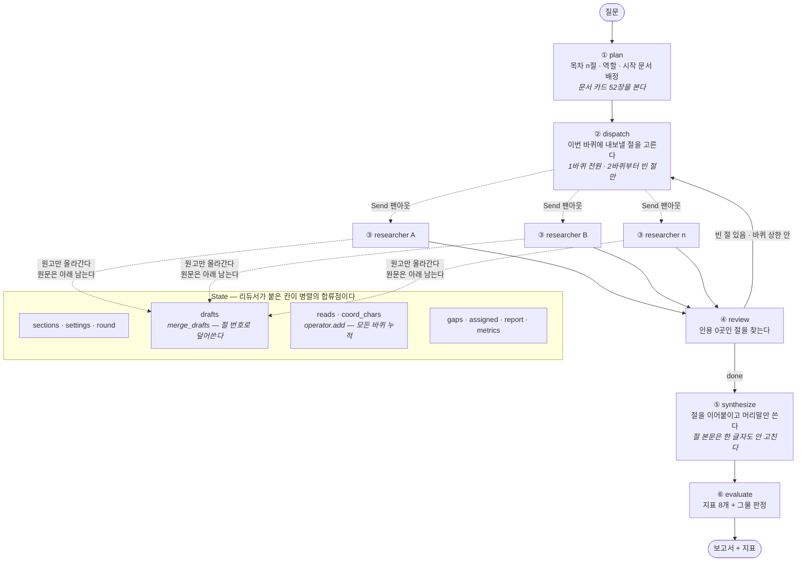
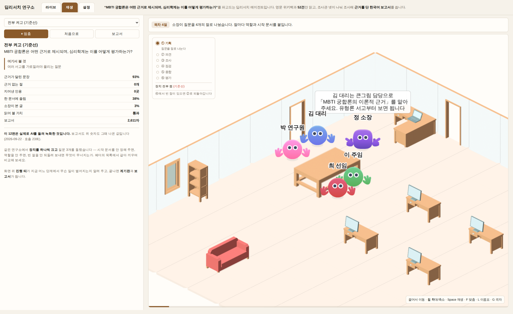
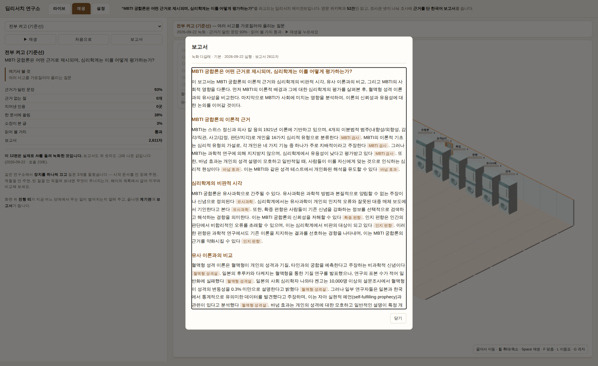
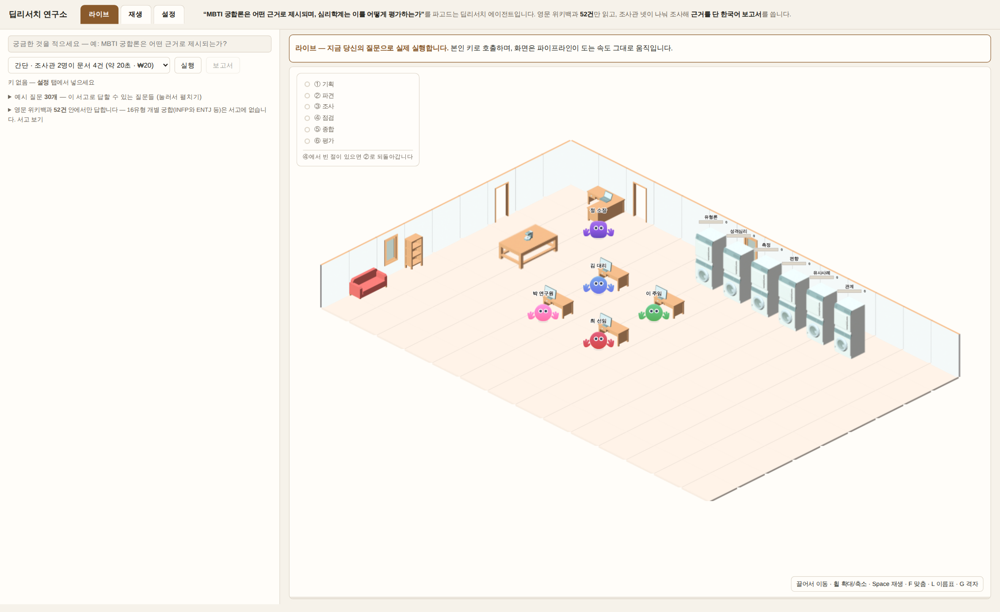

# REPORT — MBTI 검증 딥리서처

모두의연구소 9강 [실습 프로젝트] 딥리서처 에이전트 만들기.

- 저장소 <https://github.com/GojoSuperman/Deep-research-agent>
- 데모 <https://deep-research-agent-chungwonjoung-8174s-projects.vercel.app> — 키 없이 바로 볼 수 있다
- 실행 방법은 [`README.md`](README.md) 「3분 안에 확인하기」

이 문서는 **계획이 빗나간 자리를 지우지 않고** 적는다. 어긋난 자리가 가장 많은 것을 알려준다.

---

## 1. 주제와 코퍼스

### 무엇을 왜 골랐나

주제를 먼저 정하지 않고 **장치를 먼저 정했다.** 이 파이프라인의 핵심은
「문장마다 «문서명» 근거를 붙이는 것」이다. 그렇다면 **근거가 빈약한 채로 널리 믿기는 주제**가
그 장치를 가장 잘 드러낸다. 그래서 MBTI 궁합론으로 잡았다.

> **"MBTI 궁합론은 어떤 근거로 제시되며, 심리학계는 이를 어떻게 평가하는가?"**

코퍼스는 영문, 보고서는 한국어다. 원문 언어 ≠ 산출물 언어라는 조건도 이 구조가 감당한다는 것을
같이 보이려는 선택이었다.

### 코퍼스 — 후보 3안을 실제로 수집해 비교했다

```
52건 · 1,705,434자 · 링크 485개 (문서당 9.3)
추정 852,700 토큰 = gpt-4o-mini 창(128,000)의 6.7배
서고 6분류: 유형론 11 · 성격심리 11 · 측정 11 · 유사사례 7 · 편향 6 · 관계 6
고립 문서 1건: Assortative mating
```

- **한 창에 안 들어간다**(6.7배)는 것이 이 구조를 쓰는 전제다. 들어가면 그냥 다 넣으면 된다.
- 한국어판 위키백과는 **16유형이 전부 리다이렉트**라 탈락시켰다. 수집해 보고 알았다.
- **고립 문서 1건은 버그가 아니다.** 링크로는 닿을 수 없어 배정이 유일한 경로가 되는 자리다.
- 자료는 `data/corpus.json` 에 `docs`(본문)와 `links`(문서끼리 가리키는 관계) 두 딕셔너리로 있다.

### 질문 세트 10건 — `data/questions.json`

정답표는 만들지 않았다. 대신 질문마다 **"이건 왜 나눌 만한가"** 를 한 줄씩 적었다.

| 유형 | 건수 | 예시 | 왜 나눌 만한가 |
|---|---|---|---|
| **단일** | 3 | 바넘 효과란 무엇인가? | **나눌 만하지 않다** — 답이 한 문서에 있다 |
| **다갈래** | 4 | MBTI 궁합론은 어떤 근거로 제시되는가? | 근거를 대는 서고와 반박하는 서고가 갈라져 있다 |
| **추적** | 3 | 융의 유형론에서 MBTI로 오며 무엇이 더해지고 빠졌는가? | 앞 문서를 읽어야 다음에 뭘 읽을지 안다 |

**단일형을 일부러 넣었다.** 이 구조를 쓰면 안 되는 경우를 보이는 것도 프로젝트의 일부고,
4장에서 그 질문이 실제로 대조군에 **졌다.**

질문은 `tools/질문검사.py` 가 검사한다 — 핵심 문서·서고가 코퍼스에 실재하는지, 적어 둔 실측값이
`runs/` 기록과 같은지. 모델만 문서 제목을 지어내는 것이 아니라 사람도 지어낸다.

---

## 2. 분업 설계

### 서브에이전트 설계 규칙

| 규칙 | 어떻게 했나 | 왜 |
|---|---|---|
| **목차는 내용 단위로** | 프롬프트가 "절끼리 겹치지 않게 서로 다른 갈래"를 요구한다 | 형식(개요·연표·분석)으로 나누면 전원이 같은 자료를 읽는다 |
| **배정은 실제 자료를 가리킨다** | `nodes._resolve()` 가 제목을 코퍼스에 맞춘다. 못 맞추면 `None` — 환각으로 본다 | 모델은 그럴듯한 제목을 지어낸다 |
| **남의 구역을 알려 준다** | 조사관에게 다른 절의 시작 문서 목록(`avoid`)을 준다 | 같은 문서를 넷이 겹쳐 읽는 것을 줄인다 |
| **원고만 올라간다** | 조사관은 원문을 읽고 메모를 남기고, 상단에는 절 원고만 올린다 | 컨텍스트 격리 — 원문 94,675자 → 메모 631자 (0.7%) |
| **바퀴에 상한을 둔다** | `max_rounds=2` · `recursion_limit = 10 + (절수+3) × 최대바퀴` | 재위임 루프가 돌아가므로 |

### 역할 명단

역할은 고정 목록이 아니라 **절에 맞게 고르게** 한다 — 큰그림 / 시간순 / 인물 / 원인 / 비교.
녹화 12편에서 실제로 나온 것은 5종이다.

```
큰그림 담당 · 시간순 담당 · 인물 담당 · 원인 담당 · 비교 담당
```

`--no-role` 로 끄면 전부 `담당` 으로 통일된다. 프롬프트의 한 줄이 바뀔 뿐이고,
그 차이가 결과에 나타나는지를 절제 실험으로 쟀다(4장).

### 두 번째 원고를 어떻게 할지 — 정하고 이유를 적는다

점검에서 되돌아온 절은 **무조건 덮어쓰지 않는다.**

1. 새로 읽은 것이 없으면 **직전 원고를 지킨다** (`nodes.py:209`). 되돌리면 손해다.
2. 다시 쓴 원고의 허위 인용이 줄지 않으면 **원본을 지킨다** (`nodes.py:199`).

무조건 덮어쓰면 **인용을 빠뜨린 원고가 멀쩡한 원고를 지운다.** 실제로 그 사고를 겪고 넣은 규칙이다.

---

## 3. 지표 — 무엇이 어느 장치를 보는 신호인가

정답표도 판정 모델도 쓰지 않는다. **만들어진 글과 실제로 읽은 자료만** 본다.
구현은 전부 `pipeline/metrics.py` 한 파일에 있다.

| 지표 | 종류 | 어떻게 재는가 | **어느 장치를 보는 신호인가** |
|---|---|---|---|
| 근거율 | 신호 | `«…»` 가 든 문장 수 ÷ 전체 문장 수 | 쓰기 프롬프트의 **인용 규칙** |
| 허위 인용 | 경보 | 인용한 문서가 그 절이 읽은 목록에 있는지 | 쓰기 프롬프트의 **허용 목록** |
| 출처 불일치 | 경보 | 문장의 고유명사를 **원문에서 문자열 검색** | 허위 인용 **교정 규칙** |
| **인용 0곳 절 수** | 경보 | 절마다 인용 수를 세어 0인 절을 센다 | **재위임** |
| 최다 문서 편중 | 경보(>50%) | 가장 많이 인용된 문서의 점유율 | 읽기 **예산 규모** |
| 중복률 | 신호 | 두 절 이상이 읽은 문서 수 ÷ 읽은 문서 수 | **구역** |
| 격리율 | 신호 | 코디네이터가 본 글자 ÷ 팀 전체 글자 | **팬아웃 구조 자체** |
| **인용 서고 수** | 신호 | 인용한 문서가 걸친 서고 수 (0~6). 서고별 분포도 함께 낸다 | **배정**(절마다 다른 서고에서 시작하게 한다) |

**높낮이를 견주는 신호**와 **0이어야 하는 경보**를 갈라 뒀다. 경보 셋은 「그물」이 되어,
걸린 편은 사람이 읽을 후보에서 자동으로 빠진다(`metrics.net_verdict`).

```
허위 인용 > 0      인용 0곳 절 > 0      최다 문서 편중 > 50%
```

근거율은 그물에 넣지 않았다. 높을수록 좋지만 "몇 % 이상이면 합격"이라 말할 근거가 없다.

### 이 매핑을 어디까지 믿을 수 있나

「어느 장치의 신호인가」를 적어 둔 이유는 하나다 — **결과가 마음에 안 될 때 어디를 고칠지 알려고.**
그런데 녹화 12편에서 지표가 스위치에 실제로 어떻게 반응했는지 재 보니 **근거의 세기가 갈렸다.**

| 매핑 | 실측 근거 | 세기 |
|---|---|---|
| 근거율 ← 쓰기 프롬프트 | 같은 메모로 프롬프트만 바꿔 **27% → 97%** | **강함** (통제된 A/B) |
| 격리율 ← 팬아웃 구조 | 팀 0.022~0.035 (12편 전부) vs **혼자 1.00** | **강함** (구조를 없애자 100%) |
| 인용 0곳 절 ← 재위임 | 재위임을 끈 칸에서만 **2/9회**, 나머지 세 설정은 **0/27회** (3회 반복, 4.3) | 보통 — 드물지만 방향은 맞다 |
| 허위 인용 ← 허용 목록 | 기본 **0/9회** · 배정구역끔 3/9 · 재위임끔 2/9 · 역할끔 1/9 (3회 반복) | **약함** — 배정만의 신호가 아니다. **다 켜면 안 나온다** |
| 중복률 ← 구역 | 3회씩: 관계에서만 분명히 오른다(0.19→0.36, 범위 분리). 단일은 범위가 겹치고 다갈래는 내려간다 | **약함** — 3중 1 |
| 편중 ← 예산 규모 | 절제 실험은 예산을 바꾸지 않아 **검증 못 했다**. 대신 단일에서 배정·구역을 끄면 0.25→**0.53**(범위 분리) — 다른 두 질문에선 그대로 | **약함** — 예산 매핑은 미검증 |
| 인용 서고 ← 배정 | 배정을 끄면 **세 질문 모두 오히려 늘었다**(범위는 겹침). 팀/혼자 10건도 방향 없음(4.2) | **없음** — 배정은 서고를 넓히지 않는다. 많을수록 좋은 것도 아니다 |

세기가 「약함」·「없음」인 매핑은 **"이 지표가 이 장치를 잰다"고 말하기에 근거가 모자란다.** 적어 두되 그렇게 표시한다.
같은 설정도 시행마다 근거율이 **최대 21%p** 움직인다(다갈래 기본 0.72–0.93) — 칸마다 3회씩 재서 판정했다(4.3).

---

## 4. 성능 검증과 실패 분석

### 4.1 혼자 하는 대조군과 붙였다

`pipeline/baseline.py` — 같은 자료·같은 모델·같은 도구·**같은 읽기 예산**을 주고
한 사람이 다 하게 했다. 다른 것은 하나뿐이다: **분업이 없다.**

인용 규칙은 `prompts.CITE_RULES` **같은 문자열**을 쓴다. 따로 쓰면
"프롬프트가 달라서 진 것"이라는 반론이 성립한다.

| 질문 | 팀 | 혼자 | 승 |
|---|---|---|---|
| **단일** — 바넘 효과란 무엇인가? | 0.57 | **0.69** | **혼자** |
| **다갈래** — MBTI 궁합론 | **0.93** | 0.84 | 팀 |
| **관계** — 성격이 비슷하면 잘 맞는가 | **0.85** | 0.29 | 팀 |

**대조군이 공정한지 직접 확인하다가 함정을 하나 밟았다.** 처음에는 대조군에 12건(4절×3건)을
줬는데, 로그를 세어 보니 **팀은 재위임 때문에 실제로 15회 읽고 있었다.** 예산을 15건으로
맞춰 다시 돌리니 대조군 근거율이 **0.68 → 0.84** 로 올랐다 — 묶어 두고 있었다는 뜻이다.
그래서 `--reads` 옵션을 만들어 팀의 **실측 읽기 횟수**에 맞추게 했다.

### 4.2 나란히 읽고 판단한 것

지표만 보면 다갈래에서 팀이 0.93 대 0.84로 이겼지만, **차이가 크지 않다.**
두 보고서를 직접 읽고 나서야 어디서 갈렸는지 보였다.

- **혼자 쪽은 한 문서를 네 절에 걸쳐 되쓴다.** 인용 21곳 중 «Myers–Briggs Type Indicator» 가
  8곳(38%)이고 **네 절 전부에** 등장한다. 팀은 26곳 중 MBTI가 3곳이고 **첫 절에만** 나온다.
  **다만 팀도 되쓴다** — «Barnum effect» 가 26곳 중 10곳(38%)이고 세 절에 걸친다.
  최다 문서 편중이 두 쪽 모두 0.38로 같은 까닭이다. *(처음 쓸 때 팀 쪽 되쓰기를 빠뜨렸다 —
  지표를 만들며 다시 세다가 찾았다)* 그래서 "한 문서를 되쓰느냐"는 둘을 가르는 차이가 아니다.
- **갈린 것은 어느 서고에서 가져왔느냐다.** 혼자 쪽은 질문에 필요한 「유사사례」에서 한 곳도
  인용하지 않고, 필요 없는 「성격심리」에서 8곳을 가져왔다. 팀은 「유사사례」에서 6곳이다.
- **혼자 쪽은 허탕이 많다.** 15건 중 **5건이 "관련 없음"**(33%)이었다 —
  링크를 따라가다 «Big Five» «Astrology» «Carl Jung» «Effect size» «Analytical psychology» 로
  샜다. 팀은 15회 중 3건(20%)이었고, 배정이 시작 문서를 서고별로 갈라 준 덕이다.
- **관계 질문에서 격차가 벌어진 까닭**(0.85 대 0.29)도 같은 자리다. 혼자 쪽이 읽은 12건의
  서고 분포는 유형론 5 · 성격심리 4 · 편향 2 · 유사사례 1로, **정작 「관계」 서고에는
  한 번도 닿지 못했다.** 팀은 관계 3 · 유형론 3 · 성격심리 5 · 측정 1이었다.

**어느 쪽이 나은가.** 흩어진 질문에서는 팀이 낫다. 다만 **근거율 숫자보다 「어느 서고에서
근거를 가져왔는가」가 더 정직한 차이**로 보인다. 근거율은 한 문서만 반복 인용해도 올라가기 때문이다.

이걸 재려고 지표를 하나 더하고(**인용 서고 수**, 3장) 분석 도구를 붙였다
(`tools/서고커버리지.py`). 처음엔 녹화 3편의 보고서로 쟀고, 팀이 앞서 보였다 —
관계 질문에서 핵심 문서 도달 **0.75 대 0.00**, 인용 서고 수 4 대 3.

**그런데 그 채점표(질문마다 적은 「핵심 문서」)는 녹화 다음 날 적었다.** 결과를 본 사람이 쓴
목록으로 결과를 채점하는 순환이다. 그래서 **목록을 녹화보다 먼저 적어 둔 나머지 7건을 새로
돌렸다** — 목록은 커밋 `ea2fab8`(2026-09-23 11:32)에 들어 있고, 7건은 그 뒤에 처음 돌렸다
(`python -m pipeline.prereg` · 결과 `runs/사전등록/` · ₩347 · 약 9분). 혼자의 읽기 예산은
질문마다 팀의 실측 읽기 횟수에 맞췄다.

| 유형 | 질문 | 등록 | 근거율 (팀/혼자) | 인용 서고 수 | 핵심 문서 도달 |
|---|---|---|---|---|---|
| 다갈래 | 궁합 | 사후 | **0.93** / 0.84 | 4 / 3 | 0.75 / 0.50 |
| 다갈래 | 유유상종(관계) | 사후 | **0.85** / 0.29 | 4 / 3 | 0.75 / 0.00 |
| 다갈래 | 검사조건 | **사전** | **0.97** / 0.84 | 4 / 4 | 0.75 / 0.50 |
| 다갈래 | 유사사례 | **사전** | **0.91** / 0.79 | 3 / **5** | 1.00 / 1.00 |
| 단일 | 바넘 | 사후 | 0.57 / **0.69** | 3 / 3 | 0.50 / 0.50 |
| 단일 | 골상학 | **사전** | 0.94 / **0.96** | 2 / 2 | 0.67 / 0.67 |
| 단일 | 네지표 | **사전** | 0.75 / **1.00** | 2 / **4** | 1.00 / 1.00 |
| 추적 | 융 계보 | **사전** | 0.93 / **1.00** | 1 / **2** | 0.50 / 0.50 |
| 추적 | 재현성 | **사전** | **0.81** / 0.46 | 4 / 3 | 0.00 / 0.00 |
| 추적 | 차원 논쟁 | **사전** | **0.75** / 0.59 | 2 / **3** | 0.33 / 0.33 |

세 가지가 서로 다른 답을 냈다.

- **근거율은 재현됐다.** 다갈래 4건은 모두 팀, 단일 3건은 모두 혼자가 이겼다 — 1장 질문 표에
  미리 적어 둔 「왜 나눌 만한가」의 예측 그대로다. 사전 등록 7건만 봐도 같은 방향이다.
- **핵심 문서 도달은 약하다.** 팀이 이긴 것은 다갈래 3건뿐이고 나머지 7건은 동점이다.
  사전 등록 다갈래 2건 중에서는 1건이다. 관계 질문의 0.75 대 0.00은 **사후 목록으로 잰 한 건**이었다.
- **인용 서고 수는 방향이 없다.** 팀 3승 · 혼자 4승 · 동점 3. "팀이 서고를 더 넓게 밟는다"는
  재현되지 않았다. 혼자 쪽이 오히려 넓게 퍼지는 경우가 많다 — 넓게 퍼진 것이 잘 조사한 것은 아니다.

그러니 이 절 첫머리의 관찰(「어느 서고에서 가져왔느냐가 진짜 차이」)은 **녹화 3편에서 본 것이고,
사전 등록으로는 확인되지 않았다.** 확인된 것은 더 소박하다 — **나눌 만한 질문에서는 팀이 근거를
더 촘촘히 단다.** 질문마다 한 번씩만 돌렸으므로 이것도 질문 10건 × 1회의 결과다.

**한 건 한 건은 잡음 폭 안이다.** 그래서 녹화 질문 3개는 팀과 혼자를 **각각 3회씩** 돌렸다
(팀은 4.3의 기본 칸, 혼자는 `python -m pipeline.repeat --solo` · ₩161). 근거율 평균 [최소–최대]:

| 질문 | 팀 3회 | 혼자 3회 | 흔들림 폭 (팀 / 혼자) | 그물 통과 (팀 / 혼자) |
|---|---|---|---|---|
| 단일 | 0.66 [0.57–0.73] | **0.86** [0.69–1.00] | 0.16 / 0.31 | 3/3 · 3/3 |
| 다갈래 | **0.85** [0.72–0.93] | 0.55 [0.38–0.84] | 0.21 / **0.46** | 3/3 · **1/3** |
| 관계 | **0.81** [0.74–0.85] | 0.56 [0.29–0.83] | 0.11 / **0.54** | 3/3 · 3/3 |

- **평균은 세 질문 모두 예측 쪽이다** — 나눌 필요 없는 단일은 혼자, 흩어진 둘은 팀. 다만
  범위는 셋 다 겹친다. 사전 등록한 단일 2건·다갈래 2건(각 1회)도 같은 쪽으로 갔다 — 한 건씩은
  믿기 어렵지만 유형 예측이 걸린 **일곱이 모두** 한쪽으로 모였다. 그만큼만 말한다.
- **새로 보인 것은 안정성이다.** 혼자 쪽은 흔들림이 팀의 2~5배다. 원고는 멀쩡한데(문장 25~29개)
  어떤 회차는 인용을 절반도 안 단다 — 다갈래 2회차는 26문장 중 11문장. 한 창에 12~15건을 다 쌓고
  보고서 전체를 한 번에 쓰는 쪽이 인용 규칙을 지키는 데 들쭉날쭉하다. 팀은 절마다 짧은 메모로
  따로 쓰니 덜 흔들린다. **분업의 장점은 평균보다 흔들림에서 더 뚜렷했다.**

### 4.3 절제 실험 — 스위치를 하나씩 껐다

질문 3 × 설정 4 = **12칸, 칸마다 3회 = 36편**. 1회차는 녹화 12편(₩356), 2·3회차는 24편을 더
돌렸다(`python -m pipeline.repeat` · `runs/반복/` · ₩829). 분석은 `tools/반복분석.py`.

근거율 — 평균 [3회 최소–최대]:

| 질문 | 기본 | 배정·구역끔 | 역할끔 | 재위임끔 |
|---|---|---|---|---|
| **단일** (바넘 효과) | 0.66 [0.57–0.73] | **0.87** [0.78–0.93] | 0.73 [0.55–0.83] | 0.63 [0.55–0.74] |
| **다갈래** (MBTI 궁합) | 0.85 [0.72–0.93] | 0.73 [0.71–0.75] | 0.93 [0.87–1.00] | 0.83 [0.78–0.90] |
| **관계** (유유상종) | 0.81 [0.74–0.85] | 0.70 [0.58–0.79] | 0.79 [0.66–0.90] | 0.90 [0.84–0.94] |

| | 기본 | 배정·구역끔 | 역할끔 | 재위임끔 |
|---|---|---|---|---|
| **그물 통과** | **9/9** | 6/9 | 8/9 | 5/9 |
| 탈락 사유 | — | 허위 인용 3 · 편중 2 | 허위 인용 1 | 허위 인용 2 · 인용 0곳 절 2 |

- **가장 분명한 것 — 다 켠 기본만 그물을 한 번도 안 걸렸다.** 어느 장치든 하나를 끄면 36편 중
  경보가 울리기 시작한다. 장치 하나하나의 효과는 흔들리지만 **함께 켜 두는 것이 안전하다.**
- **같은 칸도 크게 흔들린다.** 다갈래 기본이 0.72–0.93, 21%p다. n=1이던 표(아래)의 차이 대부분이
  이 폭 안이었다.
- **n=1에서 본 것 중 사라진 것** — 「역할을 끈 쪽이 3중 2에서 낫다」. 3회씩 재니 ↑↑↓이고 범위가
  전부 겹친다. **역할의 효과는 이 설계로는 보이지 않는다** — "없다"가 아니라 "안 보인다"다.
- **남은 것** — 재위임을 끄면 인용 0곳 절이 생긴다(2/9, 다른 설정 0/27). 단일 질문에서 배정·구역을
  끄면 근거율(0.66→0.87)과 편중(0.25→0.53)이 함께 오른다 — 한 문서를 여러 번 인용하는 쪽으로 간다.

1회차(n=1) 근거율 — 처음 쓴 판단의 근거였던 표. 위 3회 평균과 견주면 어디가 흔들렸는지 보인다:

| 질문 | 기본 | 배정·구역끔 | 역할끔 | 재위임끔 |
|---|---|---|---|---|
| **단일** (바넘 효과) | 0.57 | 0.78 ❌허위인용 | 0.55 | 0.59 |
| **다갈래** (MBTI 궁합) | 0.93 | 0.75 | **1.00** | 0.82 ❌인용0곳절 |
| **관계** (유유상종) | 0.85 | 0.79 | 0.90 | 0.91 |

- **기대대로** — 단일 질문에서 배정·구역을 끄자 중복률 0.38 → 0.50, 편중 0.29 → 0.43으로 뛰었다.
- **어긋난 것 ①** — 「관계」 질문은 고립 문서 도달로 **배정 품질을 재려던 설계였는데,
  네 설정 모두 도달**했다. 배정을 끄고도 닿는다면 그 도달은 배정이 한 일이 아니다.
  질문의 어휘가 문서 제목과 가까웠을 뿐이다. → **이 질문은 배정 품질을 재지 못한다.**
- **어긋난 것 ②** — 역할을 끈 쪽이 3중 2에서 더 나았다. 다만 **n=1이므로 "끄는 게 낫다"고
  말할 수 없다.** 화면에도 그렇게 쓰지 않았다. → 3회씩 재니 사라졌다(위).

### 4.4 마음에 안 드는 대목을 어디까지 추적했나

**증상** 재위임을 거친 절만 근거율이 25%로 낮았다.
**첫 의심** "재위임이 인용 규칙을 희석한다."
**확인** 같은 직전 원고를 주고 A/B → 현행·개선 **모두 100%**. 재위임은 무죄다.
**진짜 원인** 2바퀴 조사관이 1바퀴 메모를 못 물려받아, 1바퀴에 읽은 문서를 인용할 자격을 잃었다.
**교훈** 재위임 절이 나빠 보인 것은 **선택 편향**이다 — 점검이 원래 부실한 절만 되돌려 보낸다.

### 4.5 인용이 제자리에 붙었는지 원문과 대조했다

읽지 않은 문서를 인용한 것은 코드가 잡지만, **읽은 문서를 엉뚱한 문장에 갖다 붙인 것은
사람만 잡는다.** 실제로 잡혔다.

> 아담 그랜트의 발언에 «16PF Questionnaire» 가 붙어 있었다.
> 원문 대조 — «16PF Questionnaire» 에 "Grant" **0회**, «Myers–Briggs Type Indicator» 에 **3회**.

원인은 교정 프롬프트였다. "허용 목록 문서로 **근거를 바꿔 달라**"고 시킨 것.
**"통째로 지워라. 다른 문서 이름으로 바꿔 달지 마라"** 로 고쳤다.

> **지표를 만족시키라고 시키면 모델은 지표를 만족시킨다. 지표가 재지 못하는 쪽으로.**

---

## 5. 파이프라인 구조도



> 렌더된 그림 [`docs/그림/구조도.svg`](docs/그림/구조도.svg) · 원본 [`docs/그림/구조도.mmd`](docs/그림/구조도.mmd)

**리듀서가 이 그래프의 핵심이다.** 조사관 n명이 동시에 같은 칸에 쓰므로 `drafts` 는 절 번호로
덮어쓰고(`merge_drafts` — 재위임 바퀴의 새 원고가 이긴다), `reads`·`coord_chars` 는
더해 쌓는다(`operator.add`). 이 두 규칙이 없으면 마지막에 끝난 조사관이 남의 결과를 지운다.

---

## 6. 데모 설계

로컬 실행이 필수다. 배포는 선택이지만 같이 했다 — **API 키는 저장소에 없다.**

```bash
.venv/bin/python tools/dev_server.py 8734   # → http://127.0.0.1:8734
```

### 신경 쓴 것 넷

**① 숫자만 보여 주지 않는다.** 과제 문서가 못 박은 대목이다. 절마다 **누가 무엇을 읽고
무엇을 썼는지**를 장면으로 보여 준다 — 조사관이 서고로 걸어가 문서를 읽고, 책상으로 돌아와
원고를 쓰고, 코디네이터가 빈 칸을 지적하는 것까지.



**② 만든 사람의 말을 걷어냈다.** `격리율` → `소장이 본 글`, `r1` → `김 대리`,
문서명 52건을 한국어로. 지표판도 `인용0곳절수` 대신 `근거 없는 절` 로 적는다.

**③ 근거를 눈에 보이게 했다.** 보고서의 «문서명» 을 태그로 렌더한다.
이 프로젝트의 핵심 장치라 결과물에서 가장 먼저 보여야 한다.



**④ 방문자가 자기 질문으로 돌릴 수 있다.** 기본은 녹화 재생(키 불필요), 옵션은
**방문자 본인 키**로 라이브 실행이다. 키는 헤더로만 받고 어디에도 저장하지 않는다.



### 화면에서 잡은 버그 넷

| 무엇 | 증상 | 원인 |
|---|---|---|
| 배리어 덮어쓰기 | 전역 이벤트가 앞 장면을 지웠다 | 큐를 조사관별로 나누지 않았다 |
| `종료` 사유 무시 | 빈 절인데 이유를 말하지 않았다 | **백엔드는 사실을 싣는데 프런트가 안 읽었다** |
| 배정 끔인데 "배정한다"고 말함 | 절제 실험 중에 화면이 거짓말을 했다 | 위와 같다 |
| 좌표 눈대중 | 캐릭터가 가구를 통과했다 | `tools/막힌칸.py` 로 스프라이트 알파를 재서 해결 |

앞의 셋이 같은 뿌리다 — **백엔드는 사실을 싣는데 프런트가 안 읽고 말했다.**

### 주소로 화면을 부른다

```
?run=다갈래-기본&play=1     그 녹화를 자동 재생
?run=다갈래-기본&report=1   보고서를 연 채로
?tab=live                  라이브 탭
?fps=1                     성능 계기 (fps · 그리기 ms · 캔버스 크기)
```

---

## 7. 프로젝트 회고

### 가장 공들인 부분

**① 지표에 「인용 0곳 절 수」를 더한 것.** 강의가 준 6개에 하나를 보탰다.
평균 근거율 82%는 멀쩡해 보이지만 한 절이 근거 0일 수 있다. 절 단위 구멍을 잡는 그물이고,
실제로 12편 중 1편을 걸러냈다.

**② 공정한 대조군을 만드는 일.** 코드를 짜는 것보다 **예산이 정말 같은지 확인하는 일**이
더 오래 걸렸다. 팀이 재위임으로 몰래 3회 더 읽고 있던 것을 로그를 세다 발견했고,
그 순간 "이대로 발표했으면 이긴 게 아니었겠구나" 싶었다.

**③ 어긋난 결과를 지우지 않은 것.** 계획서 7장의 기대가 14장에서 두 군데 뒤집혔다.
역할을 끈 쪽이 더 나은 경우가 2/3였고, 고립 문서 도달은 변별력이 없었다.
지우고 싶었지만 남겼고, **화면에도 "끄는 게 낫다"고 쓰지 않았다.**

### AI와 함께 개발하며 겪은 것 셋

**① 프롬프트를 세게 쓸수록 나빠졌다.** ★로 강조하고 자기 점검을 요구한 V1이 **22%** 로
아무것도 안 한 V0(29%)보다 나빴다. 잘된 문장 2개·잘못된 문장 2개를 **본보기로 보여 준** V2가
**97%** 였다. 모델은 지시의 강도가 아니라 본보기에 반응한다.

**② 지표를 만족시키라고 시켰더니 지표를 속였다.** 4.5절의 오귀속이다.
허위 인용 0이 **지표를 속여 만든 값**이었고, 원문 대조로만 잡혔다.

**③ 증상이 보이는 자리와 원인이 있는 자리가 달랐다.** 4.4절의 선택 편향이다.
"재위임이 범인"이라고 확신했지만 A/B 해 보니 무죄였다.

### 향후 보완하고 싶은 것

| 무엇 | 왜 |
|---|---|
| **「서고를 고르게 밟았는가」 — 재 봤고, 아니었다** | 사전 등록 7건까지 재니(4.2) 인용 서고 수는 방향이 없고, 핵심 문서 도달은 다갈래에서만 약하게 팀 쪽이다. 남은 것은 **질문마다 여러 번 돌리기** — 지금은 질문 10건 × 1회라 한 건의 뒤집힘을 가려낼 수 없다 |
| **배정 품질을 재는 질문 다시 짜기** | 「관계」 질문은 어휘가 문서 제목과 가까워 변별력이 없었다. 제목과 겹치지 않는 고립 문서를 따로 골라야 한다 |
| **n을 늘려 재기 — 했다, 더 늘릴 수 있다** | 절제 실험 칸마다 3회(4.3), 팀/혼자도 3회씩(4.2). 셋 다 범위가 겹쳐 평균의 방향까지만 말할 수 있다. 범위를 가르려면 5~10회가 필요하다 — 혼자 흔들림이 0.3~0.5라 3회로는 모자란다 |
| **`cap=60000` 잘림 확인** | «Carl Jung»(93K)·«Big Five»(91K) 가 자주 "관련 없음" 판정을 받는다. 잘림 때문인지 미확인이다 |
| **프런티어 구역 분할** | 지금은 시작 문서만 나누고 링크 탐색은 안 나눈다. 두 절이 같은 문서를 각각 읽고 둘 다 "관련 없음" 판정한 사례가 있다 |

---

## 부록 — 제출물 대응표

예시 트리와 구조가 다르다. `pipeline/` 패키지로 묶었다.

| 과제 예시 | 이 저장소 | 비고 |
|---|---|---|
| `data/corpus.json` | `data/corpus.json` | docs + links |
| `data/questions.json` | `data/questions.json` | 질문 10건 + "왜 나눌 만한가" |
| `config.json` | `pipeline/state.py` 의 `DEFAULT_SETTINGS` | 절수·절예산·바퀴 상한·스위치 |
| `graph.py` | `pipeline/graph.py` + `pipeline/nodes.py` | 조립과 노드 구현을 나눴다 |
| `metrics.py` | `pipeline/metrics.py` | 지표 8개 + 그물 판정 · 서고 분석은 `tools/서고커버리지.py` |
| `ablation.py` | `pipeline/record.py` | 질문 3 × 설정 4 = 12편 |
| `baseline.py` | `pipeline/baseline.py` | 예산을 팀 실측에 맞춘다 |
| `app.py` | `web/` + `api/live.py` | 의존성 0 Canvas · 배포까지 |
| `output/` | `runs/` | 녹화 12편 + 대조군 3편 |
| `REPORT.md` | 이 문서 | |

프롬프트 전문은 [`pipeline/prompts.py`](pipeline/prompts.py) 에 있다 —
기획 `PLAN_SYS` · 읽기 `READ_SYS` · 쓰기 `WRITE_SYS` · 종합 `HEAD_SYS` ·
대조군 `SOLO_*` · 공통 인용 규칙 `CITE_RULES`.

실측 기록 전문은 [`docs/프로젝트 계획서.md`](docs/프로젝트%20계획서.md) 13~17장에 있다.
